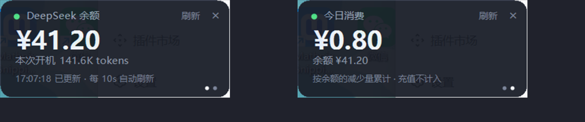
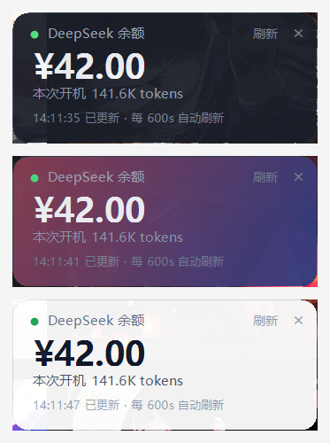

# dsh-api-balance

[](https://github.com/wwwwangpengggg/dsh-api-balance/actions/workflows/ci.yml)
[](LICENSE)

DSH 桌面插件：**打开 DeepSeek Harness 时，在桌面角落浮出一个置顶小窗，实时显示你
DeepSeek API 账户的余额，以及本次开机消耗的 token。**

```
┌──────────────────────────────┐   ┌──────────────────────────────┐
│ ● DeepSeek 余额     刷新  ×  │   │ ● 今日消费          刷新  ×  │
│ ¥11.49                       │   │ ¥3.80                        │
│ 本次开机 141.6K tokens       │   │ 余额 ¥11.49                  │
│ 09:44:39 已更新 · 每 60s …   │   │ 按余额的减少量累计 · 充值…   │
│                          ● ○ │   │                          ○ ● │
└──────────────────────────────┘   └──────────────────────────────┘
            第 1 页：余额                    第 2 页：今日消费
                    点一下金额区域 → 换页（右下角两点表示在第几页）
```



<sub>点金额区域换页。截图用的是本地假数据：余额从 42.00 掉到 41.20，于是今日消费变成 ¥0.80。</sub>

- 两页：**点一下金额区域**就在「余额」与「今日消费」之间来回切
- 七套配色 + **可以用自己的图片当背景**（右键菜单里换，不用重启）
- **点 `×` 只收进托盘**，随时叫回来；也可以 `/balance` 命令开关
- 支持高 DPI，在 125% / 150% 缩放下原生渲染不发虚

## 安装

**前置条件**：Windows 10/11 + 已安装 DSH 桌面版。不需要自己装 Node。

```powershell
# 1) 先【完全退出 DSH 桌面版】——不改这一步会失败，见下面的说明
# 2) 装进桌面版使用的 profile
dsh plugin --profile desktop add git+https://github.com/wwwwangpengggg/dsh-api-balance.git
# 3) 重新打开 DSH，小窗就会出现在屏幕角落
```

> **为什么用 `git+https://…` 而不是简写 `github:用户/仓库`？**
> 简写会被 pnpm 解析成 **SSH** 地址（`git+ssh://git@github.com/…`），于是要求你配好
> GitHub SSH 密钥；没配就会报 `Permission denied (publickey)`。显式写 `git+https://`
> 走匿名 HTTPS，公开仓库不需要任何凭据，谁都能装。（已配好 SSH 密钥的话简写也能用。）

> **为什么装之前要处理 DSH？** pnpm 会把插件包写进 profile 的 `node_modules`，而正在运行的
> DSH 实例锁着其中某些原生模块，install 会以 `ERR_PNPM_EPERM` 失败。这不是本插件的问题，
> 任何 DSH 插件在运行期安装都会撞上。
>
> 准确的规则不是「关掉 DSH」，而是——**不要往「正在运行的那个实例所使用的 profile」里装**。
> 桌面版用 `desktop`，`dsh web`（浏览器版）用 `web`，两者可以同时开着、各占一个 profile。
> 所以「我在用浏览器版，那就装进 `web`」是**反的**：那个 profile 正被占用。
>
> 三种可行做法，挑一个：
>
> 1. **把 DSH 完全退出**（最省事）。注意**关窗口不等于退出** —— 去任务管理器确认
>    `DSH Desktop` 进程全部消失；
> 2. **往当前没在用的那个 profile 里装**。例如你正在用浏览器版，就装进 `desktop`；
> 3. **用一次性 profile 试装**：`dsh plugin --profile try1 add …`。全新的 profile 谁都不占它，
>    不会和任何正在运行的实例冲突，验证完直接删掉那个目录即可。

> **如果报的 `ERR_PNPM_EPERM` 发生在你明明已经关掉 DSH 之后**，那多半不是 DSH 锁的，而是
> 杀毒软件（含 Windows Defender 实时防护）抢先去扫描 pnpm 刚写出来的
> `skia.win32-x64-msvc.node`，导致 pnpm 无法把它归位 —— Windows 上的已知竞态。
> 先把 `profiles\<名字>\node_modules` 下的 `*_tmp_*` 残留目录删掉再重试；仍然失败就把该
> profile 目录加进杀毒软件白名单。

### 如果提示「dsh 不是内部或外部命令」

`dsh` 与 `pnpm` 是**桌面版随附**的命令，默认只注入它自己启动的子进程环境，**不一定在你
自己新开的终端里**。两种解法：

1. **用 DSH 桌面版自带的终端**（如果它有的话）——那里的 `PATH` 是对的；
2. **在普通 PowerShell 里手动补 `PATH`**（推荐，一定能用）：

```powershell
# 把桌面版随附的两个命令目录临时加到本次会话的 PATH（只影响这个窗口）
$env:PATH = "$env:APPDATA\DSH Desktop\runtime-commands\bin;$env:APPDATA\DSH Desktop\host-commands\desktop\bin;$env:PATH"
dsh plugin --profile desktop add git+https://github.com/wwwwangpengggg/dsh-api-balance.git
```

> 想一劳永逸的话，把上面那两个目录加进「系统属性 → 环境变量 → 用户变量 Path」即可，
> 之后任何终端都能直接用 `dsh`。

**按版本锁定安装**（可选，用 tag）：

```powershell
dsh plugin --profile desktop add git+https://github.com/wwwwangpengggg/dsh-api-balance.git#v0.2.0
```

**卸载**：

```powershell
dsh plugin --profile desktop remove dsh-api-balance
```

### 配置 API Key

小窗要读你的 DeepSeek API Key。它会按这个顺序找：

1. 环境变量 `DEEPSEEK_API_KEY`
2. `$DSH_HOME/.credentials.yaml` 里的同名键（DSH 自己的凭据文件，通常已经配好了）

**Key 不会经过 DSH 的 IPC，也不会出现在任何命令行里** —— 小窗进程自己去读，
`tests/config.test.mjs` 有一条断言专门防这件事。

没配好时小窗会显示「未配置密钥」，配上后点「刷新」即可，不用重启。

### 如果 `dsh plugin add` 用不了

pnpm 不可用、或公司网络装不了时，可以手动装（不需要 pnpm）：

1. `git clone` 到任意目录；
2. 在 `$DSH_HOME/profiles/desktop/package.json` 的 `dependencies` 里加一行
   `"dsh-api-balance": "link:<克隆出来的绝对路径>"`，并在 `dsh.profile.bundles` 里追加 `"dsh-api-balance"`；
3. 在 `$DSH_HOME/profiles/desktop/node_modules/` 下建一个指向该目录的 **junction**
   （`cmd /c mklink /J <链接路径> <克隆路径>`）；
4. 重启 DSH。

## 它是什么形态

一个**独立的原生 Windows 窗口**（PowerShell + WinForms），不是主窗口里的浮层：

- 无边框、圆角、半透明深色卡片，`TopMost` 常驻最上层；
- 左键拖动移动，位置记在 `$DSH_HOME/plugins/dsh-api-balance/state.json`，下次启动回到原处；
- 双击或右键菜单立即刷新；右键可切 30s / 60s / 5min 刷新、取消置顶、打开充值页；
- **点 `×` 不是退出，而是收进托盘**（第一次会弹个气泡说明），随时能叫回来；
- 主窗口最小化、切换会话都不影响它。

## 两页：余额 / 今日消费

小窗有两页，**点一下金额所在的区域**就换页，再点一下换回来。右下角两个小圆点表示当前在第几页
（当前页亮、另一页暗）。右键菜单里也有同一个入口，文案跟着当前页变
（「切换到今日消费」/「切回余额」）。

| 页 | 显示什么 |
|---|---|
| 第 1 页 | 余额 + 本次开机消耗的 token |
| 第 2 页 | 今日消费的金额（下面一行是当前余额） |

「刷新」和 `×` 两个按钮、以及最底下那一行，都**不在**换页区域内，点它们不会误翻页。

**为什么不做左右滑动？** 这张卡片本身要靠**拖动**来移动位置，横向滑动会和拖拽抢同一个手势——
同一个手指动作既可能被当成翻页、也可能被当成挪窗，怎么调都会有一边不跟手。点一下没有歧义，
也更容易发现（右下角的两个点就是提示）。

### 「今日消费」的口径

DeepSeek 的余额接口**只给「还剩多少钱」，没有任何账单明细**，所以这个数字只能由余额的
减少量倒推：每取到一次余额就和上一次比，少了多少就记多少。于是有两条必须说清楚：

- **充值不计入、也不抵扣。** 余额变多时只把基准线抬上去，已经累计的消费额不动；
- **跨天或换币种一律从零重开。** 于是 DSH 关着的那段时间花掉的钱**不会**被记进来
  （下次开机第一次取数时，昨天的基准线已经被清掉了）。

也就是说它是个**近似值**，页面上因此直接标了「充值不计入」。记账写在
`$DSH_HOME/plugins/dsh-api-balance/spending.json`，由小窗独占读写；想手动清零，删掉这个文件即可。

## 关了之后怎么再打开

三种方式，按顺手程度排：

| 方式 | 怎么做 |
|---|---|
| 托盘图标 | 双击托盘里的 ¥ 图标，或右键 →「显示余额小窗」 |
| 对话框命令 | 在任意会话里输入 `/balance`（开则关、关则开） |
| 重启 DSH | 插件挂载时会自动开一次 |

`×` 只是收进托盘，进程还在，定时器照常跑——所以叫回来时余额与 token 都是新的。
真要结束进程，用托盘右键菜单里的**「退出小窗」**；那之后再想打开就用 `/balance`
或重启 DSH。DSH 退出时托盘图标会跟着消失，不会留下一个叫不回来的图标。

## 换外观（配色）

在小窗上**右键 →「外观」**，里面七个配色，点一下立刻生效，**不用重启 DSH**，选完自动记住。

| 主题 | 名字 | 大致观感 |
|---|---|---|
| `navy` | 深海蓝 | 默认。深蓝灰底 + 亮白数字 |
| `graphite` | 石墨黑 | 纯正黑灰，最素 |
| `teal` | 墨绿 | 深青绿底，状态点也偏青 |
| `plum` | 紫罗兰 | 深紫底 |
| `sunset` | 暖棕 | 深咖底 |
| `light` | 浅色 | 白底深字，跟 DSH 亮色主题一套 |
| `paper` | 米白纸 | 米色底，比纯白柔和 |

配色优先级：**右键菜单里选过的（记在 `state.json`）> 插件配置里的 `theme`**。
菜单里换一次就长期有效；想让它回到配置指定的那个，删掉 `state.json` 里的 `theme` 字段即可。



<sub>上图依次是：默认深海蓝配色 / 搭配自己的背景图 / 浅色配色（余额为本地假数据）</sub>

想自己加一套配色：在 `assets/balance-window.ps1` 的 `$script:Themes` 里加一行（九个颜色），
同时在 `lib/config.js` 的 `THEMES` 里补上同名键（`tests/config.test.mjs` 会核对两边一致），
菜单项会自动多出来。

## 换成你自己的图片当背景

小窗上**右键 →「外观 → 打开图片文件夹」**，把图片丢进去，再点**「外观 → 图片」**选一张即可。
不用重启，选完自动记住。

文件夹位置：

```
$DSH_HOME/plugins/dsh-api-balance/backgrounds/
```

- 支持 `.jpg` `.jpeg` `.png` `.bmp` `.gif`（GDI+ 能解码的格式；`.webp` 不支持，会被忽略）。
- 首次打开会放一份 `说明.txt` 在里面。
- **直接丢 4K 壁纸也没关系**：载入时会等比缩到卡片尺寸的 2 倍（例如 3840×2586 → 690×465），
  内存从 38MB 降到 1.2MB，重绘耗时从 25ms 降到 2.5ms。图片多大多小都自动处理。
- 图片**等比放大铺满整张卡片**（居中等比裁切，不拉伸变形），上面再盖一层当前主题色做蒙版，
  保证数字始终清晰。
- 图片会被读进内存后再复制一份，**不占用文件句柄**——运行期间也能删图换图。
- 「外观 → 图片」的内容每次展开都会重新扫描，所以丢进新图不用重启；也可以点「重新扫描图片」。
- 把图片删掉后启动会静默回退成纯色背景，不会报错。

### 蒙版浓度（图太淡/字太糊就调它）

**右键 →「外观 → 蒙版浓度」**，五档：无 / 淡 / 中 / 浓 / 很浓，点一下立刻生效并记住。

这是「图片清不清楚」和「数字看不看得清」之间的那根旋钮。实测数据（余额那一行的
WCAG 对比度，门槛：AA=3.0、AAA=4.5）：

| 蒙版 | 中等亮度花图 | 很亮的图 + 深色主题（最坏情况） |
|---|---|---|
| 无 | 5.50 ✅ AAA | **1.55 ❌ 读不清** |
| 淡 | 6.70 ✅ AAA | 2.31 ⚠ 勉强 |
| 中（默认） | 9.70 ✅ AAA | 4.54 ✅ AAA |
| 浓 | 12.02 ✅ AAA | 6.66 ✅ AAA |
| 很浓 | 13.32 ✅ AAA | — |

结论很简单：**图片越亮、越花，就要选越浓的蒙版**。如果选了「无」或「淡」发现数字看不清，
往上调一档就行，两秒钟的事。纯色背景（不选图）时这个设置没有影响。

图片和配色是**互相独立**的两件事：配色决定文字与蒙版的颜色，图片决定底纹。
选了「浅色」主题再配一张亮图，就会得到白蒙版 + 深色文字的效果。
要清掉图片，选「外观 → 图片 →（不使用图片）」。

## token 那一行的口径

「本次开机 141.6K tokens」= **这次启动 DSH 以来，所有会话（含子代理）消耗的 token 总量**。

- 数据来自宿主事件 `session/event`。插件在启动时挂上监听，所以只会看到本次开机之后
  追加的事件——「本次开机」这个口径是订阅时机自带的，不需要记基线，也不会随历史会话
  增长而虚高。
- 每一步模型调用会先后产生两个用量样本（流式过程中的 `assistant/chunk` 与最终装配的
  `assistant/message`）。直接相加会翻倍，因此这里照搬 DSH 自己 token-meter 的折叠语义：
  **同 turn/step 的新样本替换旧样本，跨步才累加**（见 `lib/usage.js`）。
- 总数 = 输入 + 输出 + 缓存读 + 缓存写。DeepSeek 的缓存命中输入单价更低，所以 token
  总数不等于花费；花费看上面那行余额。
- 插件把它写进 `$DSH_HOME/plugins/dsh-api-balance/usage.json`（原子写），小窗每 2 秒读
  一次。三份状态的归属是分开的，**任何时刻一个文件只有一个写者**：`state.json`（窗口
  位置与外观）和 `spending.json`（今日消费的记账）只由小窗写，`usage.json` 只由插件写。

## 生命周期

| 时机 | 行为 |
|---|---|
| DSH 启动（插件行 apply） | 拉起小窗进程 `powershell.exe -File assets/balance-window.ps1` |
| 点小窗上的 `×` | 收进托盘（进程继续跑）；托盘菜单「显示余额小窗」或 `/balance` 叫回来 |
| 托盘菜单「退出小窗」 | 真正结束进程；`/balance` 可以再拉起来 |
| 插件卸载 / DSH 正常退出 | `ctx.effect` 的清理器杀掉小窗进程（2 秒不退则 `taskkill /T /F`） |
| DSH 被强杀 / 崩溃 | 小窗自带看门狗：每 2 秒检查父进程 PID，父进程没了就真退出（不留托盘图标） |
| 重复拉起 | 命名互斥量保证同一时刻只有一个余额小窗（DSH 重启时最多等 8 秒让旧窗退出） |

两条清理路径互为兜底，正常退出和异常退出都不会在桌面上留下孤儿窗口。

## 密钥从哪来

小窗进程**自己**读密钥，插件不碰、不经 IPC、不出现在任何命令行里（`tests/config.test.mjs`
有一条断言专门防这件事）。读取顺序：

1. 环境变量 `DEEPSEEK_API_KEY`（可用 `credentialEnv` 改名字）；
2. `$DSH_HOME/.credentials.yaml` 里的同名键（DSH 的凭据文件，默认位置）。

接口：`GET {baseUrl}/user/balance`，请求头 `Authorization: Bearer <key>`。

## 安装

已经装进 **两个** profile：

| profile | 谁在用 | 装没装 |
|---|---|---|
| `$DSH_HOME/profiles/desktop` | **桌面版 DSH**（启动器里 `DSH_DESKTOP_DEFAULT_PROFILE=desktop`） | ✅ |
| `$DSH_HOME/profiles/web` | `dsh web` / 浏览器版 | ✅ |

每个 profile 里做了三件事：

- `package.json` 的 `dependencies` 加了 `"dsh-api-balance": "link:<本目录>"`；
- `dsh.profile.bundles` 里追加了 `dsh-api-balance`；
- `node_modules/dsh-api-balance` 是指向本目录的 junction（`link:` 依赖物化出来的就是这个）。

改这里的代码立刻生效，**重启 DSH** 即可看到新行为。

> **踩过的坑：装错 profile 会静默无效。** 两个 profile 装着同一批插件，光看「哪些插件生效了」
> 分辨不出正在用的是哪个。判断办法：看 `$DSH_HOME/profiles/<name>/cordis.yml` 的修改时间——
> 启动时被写过的那一个才是当前 profile；或直接读启动器
> `%APPDATA%\DSH Desktop\host-commands\desktop\bin\dsh.cmd` 里的 `DSH_DESKTOP_DEFAULT_PROFILE`。
> `dsh --profile <name> --dump-config` 可以免启动地检查某个 profile 的组合结果。

> **第二个坑：同一行不能插两次。** `api-balance` 这一行由本包自带的
> `cordis.patch.yml`（bundle 层）插入。不要再往 profile 的 `cordis.patch.yml`
> 里插一遍——loader 遇到重复 id 会抛 `duplicate loader entry id: api-balance`，
> **整个 profile 都加载不起来**。要改配置请按 id 覆盖：
> `- id: api-balance` + `config:`，而不是重插一行。

> **第三件事：用户补丁层在这台机器上并不会热加载。** `dsh-app-boot` 里有
> `watchUserPatches`，但桌面版实测改完 `cordis.patch.yml` 没有触发重组（日志无任何动静，
> 行也没挂上）。所以**任何安装/配置改动都要重启 DSH** 才算数，别指望改完即生效。

**注意**：DSH 运行期间不要在 profile 里跑 `pnpm install`。pnpm 会重写
`node_modules/@napi-rs/canvas-win32-x64-msvc`，而该原生模块被正在运行的 DSH 进程
锁定，install 会以 `ERR_PNPM_EPERM` 失败。要改成 pnpm 托管的正式安装，请**先完全退出
DSH**，再执行：

```powershell
dsh plugin --profile desktop install
dsh plugin --profile web install
```

## 配置

改 `cordis.patch.yml`（插件自带的那份是默认值），或在
`$DSH_HOME/profiles/<profile>/cordis.patch.yml` 里按 id 覆盖：

```yaml
- id: api-balance
  config:
    enabled: true
    refreshSeconds: 60      # 10 - 3600，超出会被夹紧
    corner: top-right       # top-right / top-left / bottom-right / bottom-left
    currency: ''            # 留空 = 用接口返回的第一种；可写 CNY / USD
    baseUrl: https://api.deepseek.com
    credentialEnv: DEEPSEEK_API_KEY
    credentialFile: ''      # 留空 = $DSH_HOME/.credentials.yaml
    stateDir: ''            # 留空 = $DSH_HOME/plugins/dsh-api-balance
    instanceName: DshApiBalanceWindow
```

## 开发

```powershell
npm test              # 离线：配置解析、参数一致性、脚本 BOM 与语法、进程生命周期
npm run probe         # 只抓一次余额并打印 JSON，不开窗口（会真的联网）
```

「今日消费」的累计口径写在 PowerShell 里，Node 侧调不动，所以脚本自带一个不联网、不开窗的
自检开关；`tests/window-script.test.mjs` 会跑它并断言输出（默认套件里就会执行）：

```powershell
powershell -File assets/balance-window.ps1 -LogicTest   # 期望最后一行是 LOGICTEST PASS
```

两个默认跳过的联网/上屏测试：

```powershell
$env:DSH_API_BALANCE_LIVE = '1';   npm test   # 用真实凭据抓一次余额
$env:DSH_API_BALANCE_WINDOW = '1'; npm test   # 真的拉起窗口，4 秒后再收掉
```

### 两个容易踩的坑

1. **`assets/balance-window.ps1` 必须带 UTF-8 BOM。** Windows PowerShell 5.1 对没有
   BOM 的 `.ps1` 按本地 ANSI 解码，脚本里的中文会全部变成乱码。编辑之后跑
   `npm run prepare` 补回 BOM，`npm test` 也会先自动补一次并断言存在。

2. **脚本的 `param(...)` 块和插件构造的开关必须对得上。** 参数名写错不会报错，只会
   让窗口起不来。`tests/config.test.mjs` 会解析脚本的 `param` 块，逐一核对插件传的每
   个开关，改一边忘改另一边会直接测试失败。

## 故障排查

| 现象 | 检查 |
|---|---|
| 小窗完全不出现 | `npm run probe` 能否拿到余额；`assets/balance-window.ps1` 是否被杀软/组策略拦了 `-ExecutionPolicy Bypass` |
| 小窗显示「未配置密钥」 | `$DSH_HOME/.credentials.yaml` 里是否有 `DEEPSEEK_API_KEY`，或环境变量是否带进了 DSH 进程 |
| 小窗显示「获取失败」 | 网络/代理；余额接口返回体里是否有 `balance_infos` |
| token 行一直是 0 或「暂无数据」 | `usage.json` 是否存在且 `updatedAt` 在变；没有它说明插件没装上（`dsh --profile web --dump-config` 里应当有 `api-balance` 行） |
| DSH 退出后小窗还在 | 看门狗依赖 `-ParentPid` 参数，检查插件是否真的传了 `ParentPid` |
| 今日消费一直是 ¥0.00 | 多半正常：余额没减少就不会有消费。可看 `spending.json` 里的 `lastBalance` 是否与当前余额一致；跨天重启后从零重开也是预期行为 |
| 换了新版本但小窗没变 | 小窗是 DSH 启动时拉起的一次性进程，**装完/改完要重启 DSH** 才会跑新代码 |
